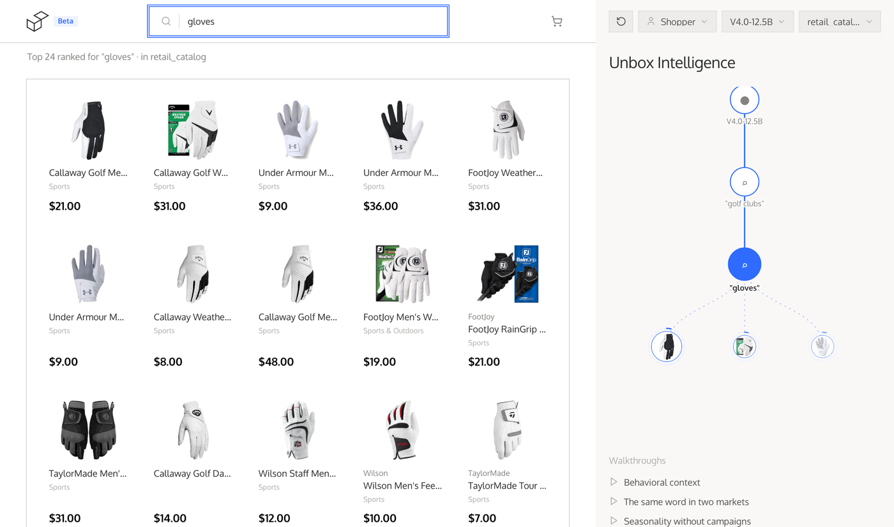
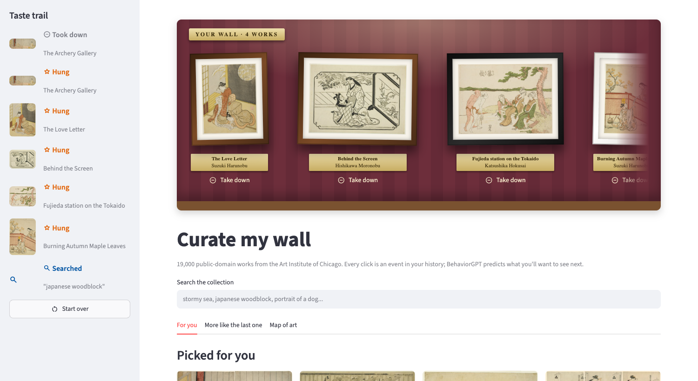

# BehaviorGPT

**The foundation model for behavior.** [Website](https://unboxai.com/behaviorgpt) · [Live demo](https://behaviorgpt.unboxai.com/) · [Research](https://research.unboxai.com) · [Notebook](https://github.com/Unbox-AI/behaviorgpt/blob/main/notebooks/showcase.ipynb)

Two apps built on this SDK, one on a store's catalog and one on a museum's:

<table>
  <tr>
    <td width="50%"><a href="https://behaviorgpt.unboxai.com/"></a></td>
    <td width="50%"><a href="https://github.com/Unbox-AI/aic-artworks"></a></td>
  </tr>
  <tr>
    <td><b>Storefront</b> (<a href="https://behaviorgpt.unboxai.com/">live demo</a>). "gloves" after "golf clubs" returns golf gloves; the panel shows the history the model read.</td>
    <td><b>Curate my wall</b> (<a href="https://github.com/Unbox-AI/aic-artworks">source</a>). An art recommender over 19 000 artworks, built on this SDK.</td>
  </tr>
</table>

**BehaviorGPT** is UnboxAI's Large Behavioral Model. It is trained on long sequences of things people actually did (viewed this, added that, bought the other) and predicts what comes next, so search, recommendations and personalization are the same call with different histories. BehaviorGPT-v4 is a single 12.5B-parameter model pretrained on 150 billion user actions across retail, engagement and payments, and it ranks catalogs it has never seen with no training.

This repository holds the Python client for the UnboxAI API and a notebook that walks through the model step by step.

## Requirements

- An UnboxAI API key. Create & copy the key at [unboxai.com/behaviorgpt](https://unboxai.com/behaviorgpt); the key also arrives by email.
- Python 3.11 or newer.

## Quick start

```sh
pip install behaviorgpt
export UNBOXAI_API_KEY=...   # or pass api_key= to UnboxAIClient
```

```python
from behaviorgpt import Search, UnboxAIClient, View

client = UnboxAIClient(market="us")

# a history of one search
res = client.complete([Search("running shoes")], limit=5)
print(res.names)

# the same call, personalized: a viewed item (Nike pants), then a query
res = client.complete([View("paB08NYK61PJ"), Search("shoes")], limit=5)
print(res.names)

# items close to one another in the model's space
print(client.similar_items(res.items[0].id).names)
```

`complete` takes the history and returns the items most likely to come next. Each result in `res.items` has an `id`, a `score` and the catalog row in `data`; `res.to_pandas()` gives a DataFrame if pandas is installed.

## How it works

- **One call, many features.** Every request asks the same question: given what this person did, which items are they most likely to act on next? The history picks the feature. End it with a `Search` for search results, with a `View` for "more like this", with an `Order` for what is bought next; leave it empty for a cold start.
- **The whole sequence counts.** The model reads the history in order, so the same query means different things after different actions: "gloves" after "golf clubs" returns golf gloves. `market` on the client says where the user is, which helps most when the history is short.
- **Items are read from their content, not their ids.** Each item is embedded from its name, brand, categories, image and price. That is why the model can rank a catalog it has never seen as soon as it is uploaded, with no interaction data and no training, and why those columns decide how well it does ([catalog format](https://github.com/Unbox-AI/behaviorgpt/blob/main/docs/catalog-format.md)).
- **One pass per request.** Item vectors are computed once when the catalog is embedded, so ranking the whole catalog costs one forward pass over the history rather than one per item: the model itself takes under a millisecond per query, and most of an API call's time is the network.

## The notebook

[`notebooks/showcase.ipynb`](https://github.com/Unbox-AI/behaviorgpt/blob/main/notebooks/showcase.ipynb) covers the model in eight steps: setup, a first query, one call for many features, how context changes the answer, then embedding your own catalog, inspecting the embedding space, querying it, and trying it in the demo.

Needs [uv](https://github.com/astral-sh/uv). Clone, install, add your key, register the kernel, start JupyterLab:

```sh
git clone https://github.com/Unbox-AI/behaviorgpt.git
cd behaviorgpt
uv sync
cp .env.example .env   # paste your key as UNBOXAI_API_KEY
uv run ipython kernel install --user --env VIRTUAL_ENV $(pwd)/.venv --name=behaviorgpt-env
uv run jupyter lab
```

JupyterLab opens in your browser. Open the notebook and pick the `behaviorgpt-env` kernel.

## Your own catalog

The model can only return items it knows about. Out of the box the client uses `retail_catalog`, a sample retail catalog. To use the model on your own data, upload your catalog as a parquet file. A catalog doesn't have to be products for sale: artworks, articles, listings or anything else people browse and pick from work the same way.

- The required columns and types are described in [`docs/catalog-format.md`](https://github.com/Unbox-AI/behaviorgpt/blob/main/docs/catalog-format.md).
- A catalog can hold at most 20 000 items.
- [`examples/sample_catalog.csv`](https://github.com/Unbox-AI/behaviorgpt/blob/main/examples/sample_catalog.csv) is an example only, showing what each column should contain. Your own file will look different depending on your catalog, and it has to be converted to the parquet structure described in the format doc before upload.

```python
job = client.embed("my_catalog.parquet", wait=True, timeout=1800.0)
client.complete([Search("...")], catalog_id=job.catalog_id)
```

If mapping your data to the format is hard, open a coding agent in this directory and ask it to embed your catalog. The repo ships a skill at [`.claude/skills/embed-catalog/SKILL.md`](https://github.com/Unbox-AI/behaviorgpt/blob/main/.claude/skills/embed-catalog/SKILL.md) that walks the agent through mapping your columns, building and validating the parquet, checking image URLs, and uploading. Claude Code picks it up automatically; for other agents, point them at that file.

### Events

A history is a list of `Search`, `View`, `AddToCart`, `RemoveFromCart` and `Order` events. The names come from a store because that is what the API accepts, but they work for any catalog: map your users' actions by meaning. Curate my wall, below, sends "look closer" as `View`, "hang it on the wall" as `AddToCart` and "take it down" as `RemoveFromCart`.

## Demo and examples

- [behaviorgpt.unboxai.com](https://behaviorgpt.unboxai.com/): a storefront, with recommendations, personalized search and a cart driven by the shopper's clicks. To try it on your catalog once it is embedded, select the **BehaviorGPT V4.0-12.5B** model, choose **Bring your own catalog** and enter your API key. Images must be publicly reachable for the demo to display them.
- [Curate my wall](https://github.com/Unbox-AI/aic-artworks): an art recommender over 19 000 public-domain artworks from the Art Institute of Chicago. It shows the whole path for a catalog that isn't products: turning an open dataset into a catalog, embedding it, and driving recommendations, search, similar items and the embedding map from a visitor's clicks.
